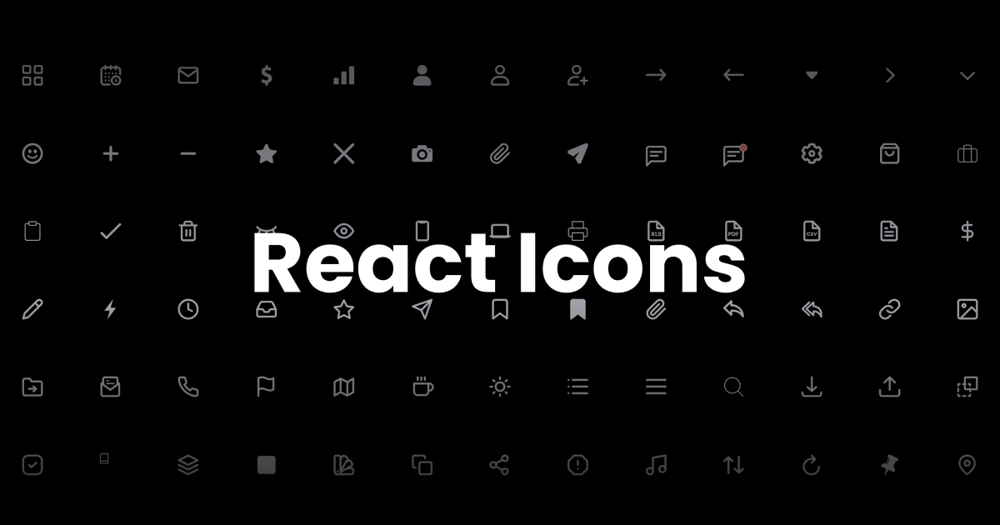
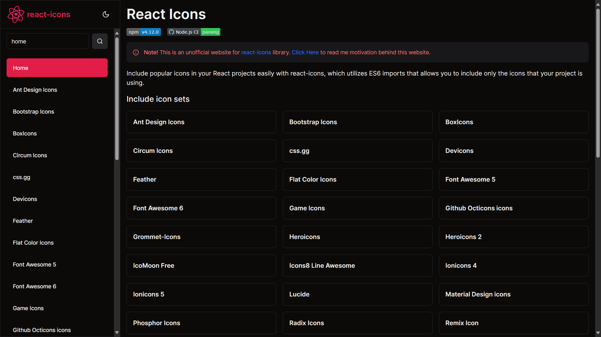
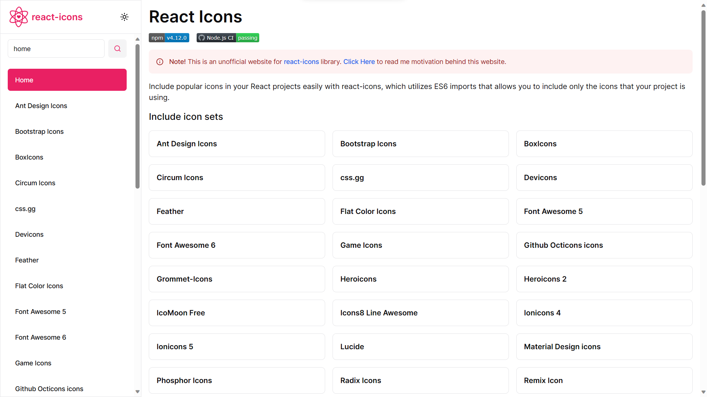
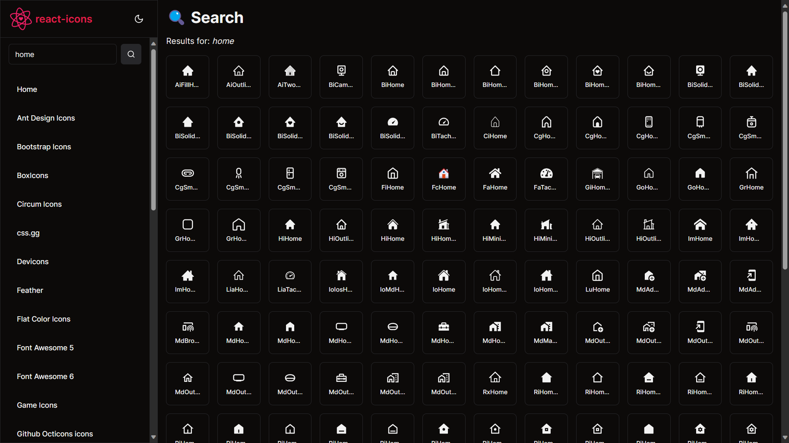
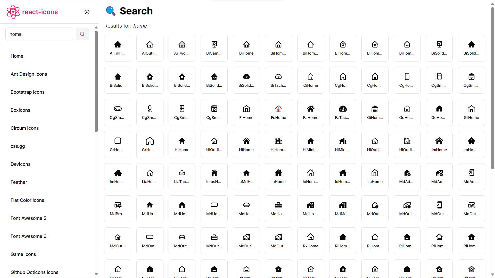
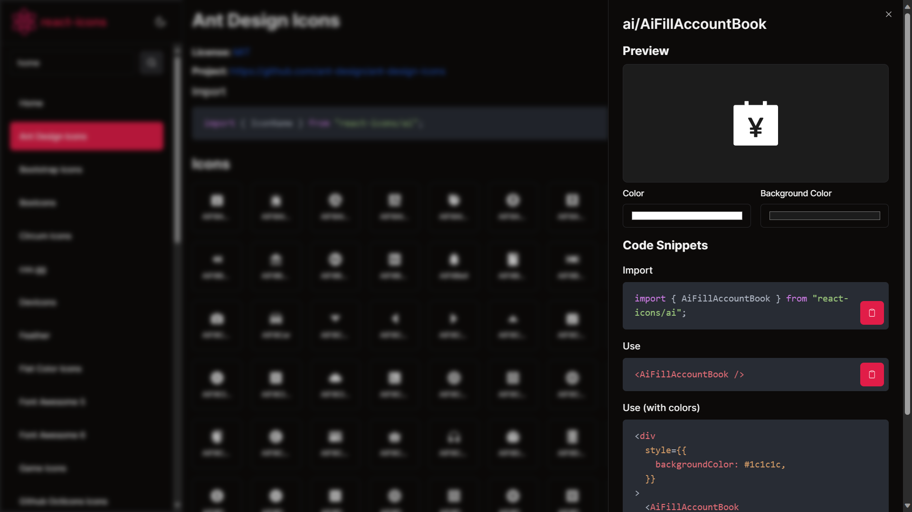
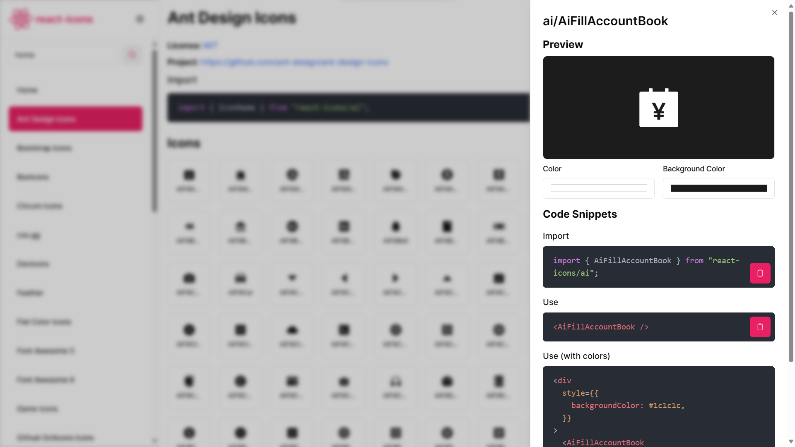

# React Icons v2



Hi there! 👋 I'm Sahil Verma, and this is the repository for React Icons v2, a website aimed at providing a modern and visually appealing experience for users interested in React Icons.

## About

The motivation behind building this site was to offer a fresh and updated look compared to the official React Icons website. I found the official site lacking in terms of aesthetics and modern design principles, so I decided to create a new and improved version.

For the development of this website, I chose Next.js for its server-side rendering capabilities, Tailwind CSS for a utility-first styling approach, Shandn for a sleek design, and, of course, react-icons to showcase a wide variety of icons.

**Please note:** This is not the official [React Icons](https://react-icons.github.io/react-icons/) website, and I do not own the [React Icons repository](https://react-icons.github.io/react-icons/). All credits for the fantastic React Icons library go to the original creators and contributors.

Feel free to explore and enjoy the collection of React Icons on this website!

## Screenshots

1. **Home Dark**
   

2. **Home Light**
   

3. **Search Dark**
   

4. **Search Light**
   

5. **Icon Sidebar Dark**
   

6. **Icon Sidebar Light**
   

## Getting Started

To get started with React Icons v2, follow these steps:

1. **Clone the Repository:**

   ```bash
   git clone https://github.com/sahilverma-dev/react-icons-v2.git
   ```

2. **Install Dependencies:**

```bash
npm install
```

3. **Start the Application:**

```base
    npm run dev
```

## Connect with Me

- My Website: [sahilverma.dev](https://sahilverma.dev)
- Instagram: [sahilverma.dev](https://instagram.com/sahilverma.dev)
- Twitter(𝕏): [sahilverma_dev](https://twitter.com/sahilverma_dev)
- LinkedIn: [sahilverma-dev](https://www.linkedin.com/in/sahilverma-dev/)
- Dev.to Articles: [sahilverma_dev](https://dev.to/sahilverma_dev)
- More Articles on My Website: [sahilverma.dev](https://dev.to/sahilverma_dev)

For any inquiries, you can reach me at sahilverma.webdev@gmail.com.

Now you can visit http://localhost:3000 in your browser to explore React Icons v2!

Feel free to contribute or provide feedback. Happy coding! 🚀
